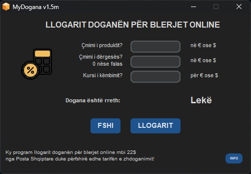

# <b>MyDogana</b> #

Është një program i thjeshtë që krijova pasi përtoja të bëja disa llogaritje të njëpasnjëshme manualisht për të gjetur vlerën e doganës 
për blerjet online mbi 22$ nga Posta Shqiptare duke përfshirë edhe tarifën e zhdoganimit. N.q.s ju nevojitet mund ta shkarkoni [Këtu](https://github.com/marseltefa/mydogana/releases)

Programi vjen në dy versione identike nga ana e funksionit ndyshon vetëm ndërfaqja.

Versioni (c) Classic i verdhë është portabël ka vetëm një exe dhe s'ka nevoj për instalim.

  <a href="https://github.com/marseltefa/mydogana/releases">

  
  Dhe Versioni (m) Modern që bëhet automatikisht Light ose Dark në bazë të zgjedhjes që keni bërë në Windows por vjen me Setup për tu instaluar.
  

  <a href="https://github.com/marseltefa/mydogana/releases">

     
    

  <a href="https://github.com/marseltefa/mydogana/releases">

  

- ⛔ KUJDES: Ky program nuk llogarit doganën për blerjet me posta të tjera private që kanë tarifa të ndryshme zhdoganimi nga Posta Shqiptare apo aktivitete biznesi që kanë tarifa të ndryshme doganore për produkte të ndryshme!
